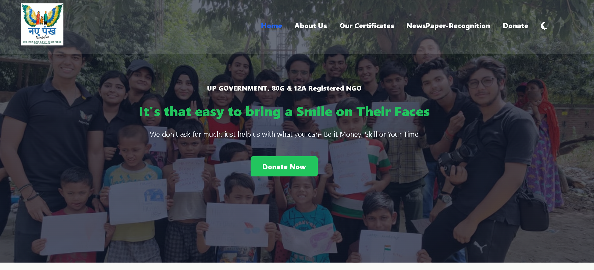
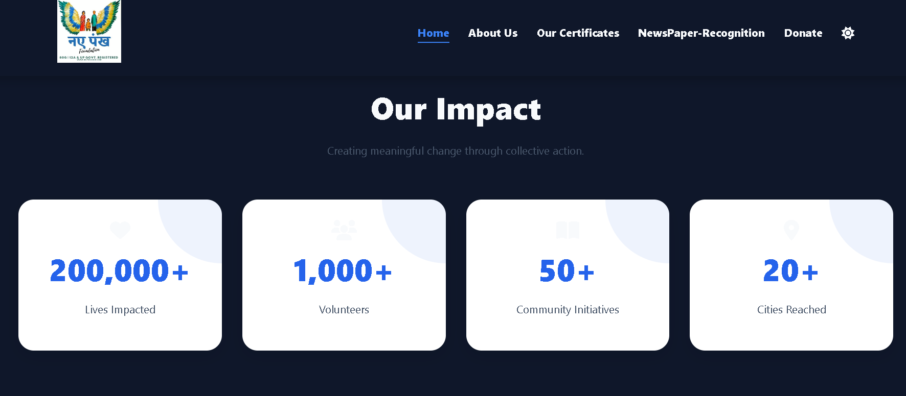
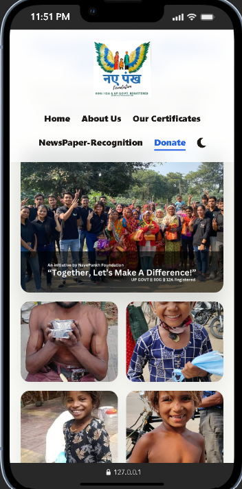
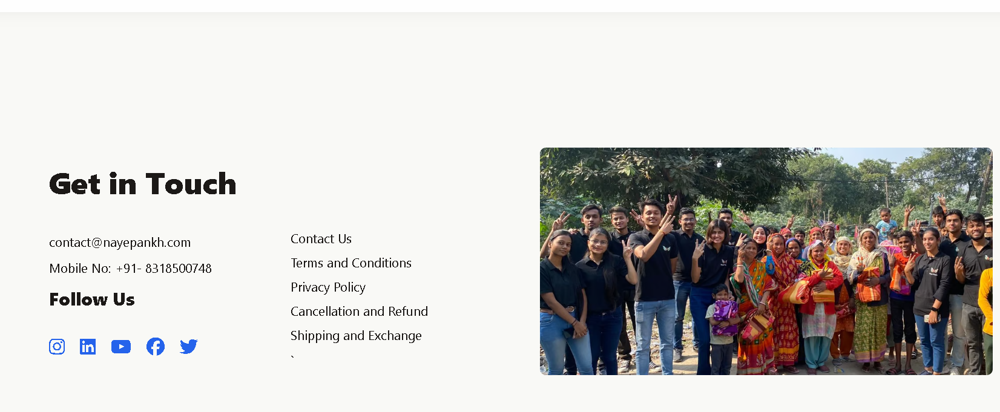

# NayePankh Foundation 🕊️


A modern, highly responsive, and interactive front-end website built for the NayePankh Foundation, a UP Government, 80G & 12A Registered NGO. This project focuses on delivering a premium user experience to encourage donations, volunteer sign-ups, and community awareness.

🔗 **[Live Demo: View the Website Here](https://geetanshu17-tech.github.io/nayepankh-ngo-website/)** ---

## ✨ Key Features

This project was built with a strong emphasis on modern UI/UX principles, performance, and accessibility.

* **Persistent Dark/Light Mode:** Seamless theme toggling utilizing CSS Variables and `localStorage` to remember user preferences across pages.
* **Advanced UI Patterns:** Features a frosted-glass (`backdrop-filter`) sticky navigation bar and a cinematic "Curtain Reveal" footer utilizing z-index stacking.
* **Cinematic Animations:** Integration of GSAP (GreenSock) for smooth, buttery vertical auto-sliders and scroll-triggered animations.
* **Intelligent Navigation:** Custom JavaScript logic automatically detects the current URL path to highlight the active navigation link.
* **Responsive "Bento Box" Layouts:** Utilizes advanced CSS Grid to dynamically restructure complex image galleries (like the Donate page) into optimized layouts for mobile devices, eliminating the need for horizontal scrolling.
* **Smooth Scrolling:** Integrated Lenis API for frictionless, momentum-based scrolling across the entire site.

## 🛠️ Tech Stack

* **Structure:** HTML5 (Semantic Markup)
* **Styling:** CSS3 (Custom Properties/Variables, Flexbox, CSS Grid, Media Queries)
* **Logic:** Vanilla JavaScript (ES6+)
* **Animation & Scrolling:** GSAP (ScrollTrigger), Studio Freight Lenis
* **Icons:** FontAwesome 6

## 📂 Project Structure

```text
📦 nayepankh-ngo-website
 ┣ 📂 assets
 ┃ ┣ 📂 collage         # Images for Newspaper Recognition
 ┃ ┣ 📂 icons           # Logos and branding
 ┃ ┗ 📂 images          # Hero backgrounds, program cards, etc.
 ┣ 📜 index.html        # Home Page
 ┣ 📜 aboutus.html      # About Us Page
 ┣ 📜 donate.html       # Donation Portal & Bento Gallery
 ┣ 📜 Certificates.html # Government Registrations Gallery
 ┣ 📜 Newspaper_Recognition.html 
 ┣ 📜 style.css         # Global styles, variables, and responsive queries
 ┣ 📜 aboutus.css       # Page-specific styling overrides
 ┣ 📜 donate.css        
 ┣ 📜 certificates.css  
 ┣ 📜 nws-recog.css     
 ┗ 📜 script.js         # Core logic (Dark mode, GSAP slider, active states)


##  🚀 Getting Started
To view or modify this project locally:

**1. Clone the repository:**

git clone [https://github.com/geetanshu17-tech/nayepankh-ngo-website.git](https://github.com/geetanshu17-tech/nayepankh-ngo-website.git)

**2. Navigate to the project directory:**
cd nayepankh-ngo-website

**3. Open `index.html` in your preferred web browser:**
- You can simply double-click the `index.html` file, or use a live server extension in your code editor for a better development experience.


## 📸 Screenshots

| Light Mode (Home) | Dark Mode (Impact Section) |
| :---: | :---: |
|  |  |

| Mobile Bento Grid (Donate) | Curtain Footer Reveal |
| :---: | :---: |
|  |  |

---
*Designed and Developed with 💻 and ☕ by geetanshu17-tech*
